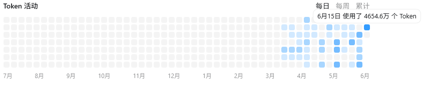
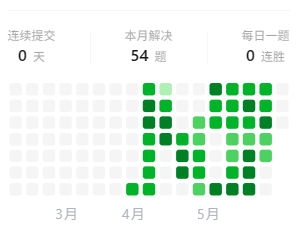

这几个月实在是没拍啥照片，放一张五一回家和家里人一起吃火锅的图片凑数（）

由于太久没写总结，已经记不清这几个月发生啥事了，干脆随便写点意思一下💩

# 学了些东西但不多

从三月以来，狠狠补了很多 agent 相关的东西，隐隐约约觉得对这里面的东西有一定自己的理解了，那些之前面经里看不懂的词现在多少也能说出来一些浅薄的理解，跟打怪升级一样，确实有种我也在变强的感觉（或者说是错觉？）。

从 github 上拉了两个 Claude Code 的源码和教学仓库，每天看一点一共看了两遍，一边感叹里面精妙的设计，一边在感叹后过一阵子就忘掉大半部分🙄，常看常新真有它的道理吧。看完 Claude Code 又去看了一下 Openclaw ，可能是后面才看的它，总感觉有些地方的设计没有cc印象深刻，真成了 agent 入门的白月光了🤷‍♂️

看完这些教学，这一段时间就忙着对 nanobot 进行改造，加各种模块，将学到的一些思想应用到这个小项目上，也算有一些不错的成果，用飞书和这个小机器人说话的时候还是有一定成就感的hh。不过话虽如此，大部分编码任务还是 codex 帮我干的，和 codex 商量完具体策略后就让他干，等他的十分钟是我玩手机最开心的半小时.jpg 。顺便吐槽一下，之前用的不多，现在习惯后觉得 plus 的量还是有点少了，经常一个小时就干完五个小时的量，每个月80块也不算太便宜，后面可能还会涨价，唉，已经被ai惯坏了。

除了 agent 这边，后端那边也跟进了一些，不过不是主攻方向：补了b站的 Kafka 教程视频，了解了一下它的用法和底层架构；补了一下微服务那块的东西，比如 nacos 啊，熔断降级啊之类的，不过这些都很快，作为了解来说感觉已经足够了。

最后就是 leetcode 刷题，这俩月终于是成功刷了两遍 hot100，虽然到现在为止有些题还是不太会写，不过大部分都能有思路了，调一调bug基本上也能过，这算我变强了吗（？

课题上的话……emm……依旧在调研，每隔两周讲一次论文，按部就班的来，我现在也没太管这方面的事。安排给我的横向我也处于挤牙膏状态，师兄问了我就把我做好的给他，没问就是没做好hh。前一阵课题组小组第一次聚餐，认识了一些很厉害的博士，然后就没啥了好像。

看起来好像没做很多事，事实也确实是没做很多事。唉，间歇性奋发图强，持续性混吃等死是这样的。如果像我考研那样拼命学，我现在肯定能找到不错的实习了，单人宿舍还是太助长我的懒惰了😥

后续计划就是看一看Java和Agent那边的八股吧，然后再完善一下nanobot和黑马点评的项目，然后就可以准备简历投实习了。希望能找一个差不多的实习吧

# 玩了什么

最近又开始玩斯普拉遁了，拿到了金蛇的徽章，感觉不错。然后就没玩什么了，也没接触什么新的游戏，毕竟现在再学一个新的游戏还是有点儿太费精力了，就玩点之前玩过的游戏吧。

# 碎碎念

五一那个假期回了趟家，和家人吃了顿火锅，也就是那张题图。五月二十几号，爷爷百天，那天我没回去。然后是五月二十八号，那天我生日，但是什么也没发生，就是很普通的一天。下周末是端午节，但是假期中间那天我刚好要考试，所以还回不了家。下次回家可能就得等所有考试都考完，或者等我们暑期集训结束了。

还有就是，我也记不清之前梦到过爷爷的是哪一天了。

第一次梦见他，他没有出现。我梦见我去医院里找他，刚进医院大门，就碰见已经去世的老姨奶。我问爷爷咋样，然后她不说话，我就抱着老姨奶奶哭，然后就醒来了。

第二次梦见他，好像就是上周吧，梦见我回丈八北路，他和奶奶都在家，他们做了一个小饭盒的樱桃酱，还给我摆了一盘樱桃，然后我就边吃樱桃边跟他们聊天，具体聊的啥我记不清了。印象最深的就是一句，好像是奶奶问，她问我如果我去了学校之后会想家吗？我当时的回答是，刚去学校可能不是太想，在学校待得越久就越想家。然后梦醒了，我才意识到是不是他们在那边害怕我太想他们了，专门给我带了点儿水果，让我别想他们。

然后就是昨天晚上，我梦见我坐大巴车，突然上来了几个人，里面就有我的舅爷和老姨奶。我正想给他们让座，看到他们俩身后站着的是爷爷。这是我第一次在梦里这么近距离这么清晰地看清他的脸。在那一瞬间，我意识到这是梦，然后我就醒来了。我特别后悔没有跟他说上话，为什么我这么想见他，好不容易梦见他一次，结果意识到这是梦的时候，我的身体自己就醒了。就只见了这一面。哎，太难受了，今天醒的时候五点多，然后就再也没睡着。

有时候我在微信搜索其他联系人，他会给我推荐爷爷的微信，然后我点进去，里面就只有之前的通话记录。最后一次通话记录，2月6号，就是他去世前的一周，如果我知道他就剩一周时间了，我当时哪儿也不去，我就陪在他身边，太难受了，现在想起来还是会哭。

我本来以为我都已经接受了，但是现在一想起这个事儿，我还是忍不住。哎，之后多做梦梦到就好了。唯一能安慰到我的就是我昨晚梦到他的时候，他的气色很好，很精神，穿的是他年轻时候喜欢的夹克。让老头儿去那边找老伴儿，在那边团聚也挺好的。想想也就想开了，大概吧。